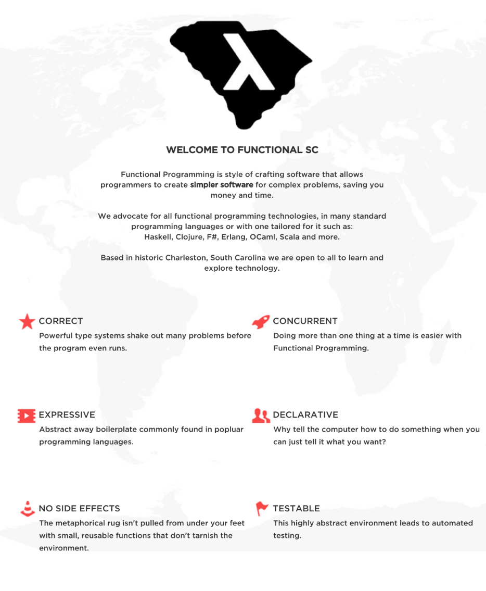

# sc.functional.website

This is the website for Functional.sc packaged as a webapp.  Although it can run standalone it should be deployed within Jetty.

This is all about to change!

The primary reason for the Jetty deployment is because this was forked from LispNYC which has a lot of functionality and leverages several different webapps.

Functional.sc only uses Smeagol (a Clojure-based wiki) for it's CMS so it should be easy to integrate them.

Any technology upgrades (Java runtime or Clojure) necessitate an upgrade in Jetty which honestly is a pain to setup running webroot, static asset paths etc.  Hence the plan to website-ify Smeagol.

## Prerequisites

You will need [Leiningen][] 2.0.0 or above installed.

[leiningen]: https://github.com/technomancy/leiningen

...also Java to compile and run Clojure

## Running

To start a web server for the application, run:

    lein ring server

